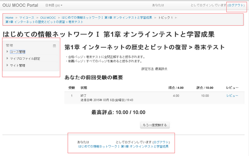
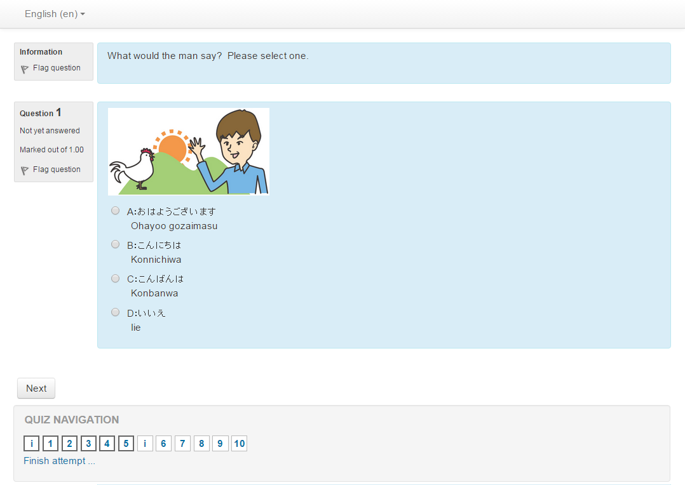

概要
============
このテーマはHybrid CHiLO Bookの利用に必要な、最適化されたMoodleのテーマです。   
クイズやフォーラム画面などで不必要な部分を非表示させています。

  

↓  

  

なお、このテーマは、Moodle2.6の時点で用意されたClean themeをベースに作成しました。

テーマ適応
---------------------------------
chiloフォルダを、Moodleのテーマディレクトリに配置し、通常のMoodleテーマのインストールに加え、

    # mv chilo <MOODLE_DIR>/theme/

weblib.patchをMoodleディレクトリ直下に配置し、パッチコマンドを実行してください。

    # mv weblib.patch <MOODLE_DIR>/
    # patch -p0 < <MOODLE_DIR>/weblib.patch

テーマの有効化・無効化
---------------------------------
このテーマを適応したページにアクセスすると、編集するのに必要な箇所も非表示になり困るので、   
非表示部分を無効するため対応を加えています。

※デフォルト設定の場合
* 非表示を無効にしたい場合、URL末尾に ?(&)chiloflag=2 と引数を加えます
* 非表示を有効にしたい場合、URL末尾に ?(&)chiloflag=0 と引数を加えます

設定などに関しての詳細はこちらを見てください  
https://github.com/cccties/moodle-theme_chilo/wiki
